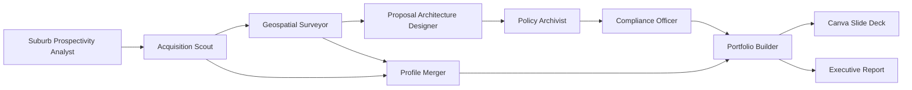
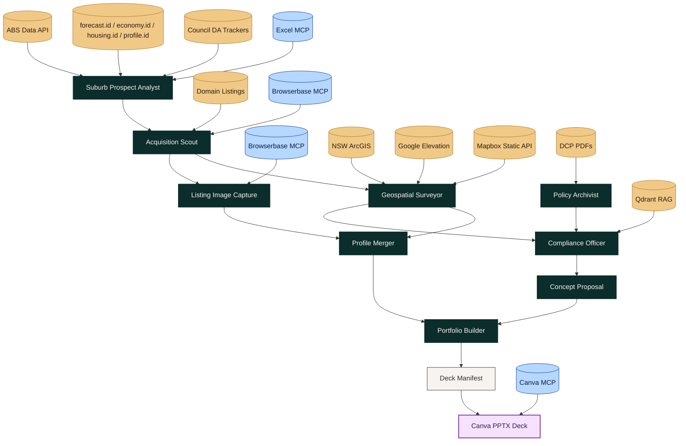

# MAS Sydney Residential Development Approvals

A multi-agent, MCP‑enabled system that scouts high‑ROI suburbs, audits properties, and generates council‑ready feasibility decks with GIS visuals, compliance risk, and executive reporting. This MAS is built for developers who want **fast, defensible feasibility signals** before formal DA submission.

## Why This Exists
This pipeline emulates a high‑performing property development team:
- Finds promising suburbs and properties.
- Performs geospatial due diligence.
- Ingests and queries council DCPs (RAG).
- Produces compliant concept proposals.
- Outputs a **premium PPTX slide deck** per property.

> **Positioning:** This MAS is built for developers to validate feasibility early, before formal DA lodgement.

## What You Get
- End‑to‑end autonomous feasibility pipeline.
- GIS composite maps (hazards + zoning + hillshade) with legends.
- Listings and satellite imagery captured automatically.
- Compliance risk summaries and follow‑ups.
- A presentation‑ready slide deck for stakeholders.

---

## Live Real Estate & Council Dashboard

The new React-based FE visualizes Langchain MAS intelligence, displaying data-driven property scoring alongside live real-estate prospects, demographics, and regional growth metrics for councils across Sydney.

*(Dashboard screenshot with Langchain MAS and Council Data)*


*(Property Drill-Down & Policy Assistant AI View)*


---

## Architecture At A Glance



---

## Core Workflow (Detailed)



### Data Sources By Stage

| Stage | Primary Sources | MCP / Tools |
|---|---|---|
| Suburb Prospectivity Analyst | ABS Data API, forecast.id, economy.id, housing.id, profile.id, DA trackers | `Socio‑Economic Suburb Scanner`, `ID Data Scraper`, `ID Key Metrics Extractor`, `Council DA Tracker Scraper`, `DA Geocode Enricher`, `DA Hot Streets Aggregator`, `ABS Approvals + DA Merger`, `Prospectivity Excel Updater` |
| Property Scouting | Domain listings | `Property Scraper` (Browserbase + Playwright) |
| Listing Images | Domain listing photos | `Listing Image Capturer` (Browserbase + Playwright) |
| Site Survey | NSW ArcGIS (hazards), Nominatim (geo), Google Elevation | `NSW Planning API`, `Hazard Overlay Checker`, `Slope & Topography Analyzer` |
| GIS Composite Map | NSW ArcGIS polygons + Mapbox style w/ hillshade | `GIS Composite Map` |
| DCP Ingestion | Council DCP PDFs | `Autonomous DCP Harvester`, `PDF Ingestion Engine` |
| Compliance | Qdrant RAG + rules heuristics | `Qdrant Policy Query`, `Compliance Checker` |
| Deck Production | Canva MCP | `@canva/cli@latest mcp` |

### Web Scraping + UI Automation (Browserbase)

Browserbase provides a remote browser context for Playwright. The agents use it to:
- Load target pages (Domain, council trackers).
- Capture **full-size screenshots** and **element screenshots**.
- Extract DOM content to decide next actions (e.g., paginate, open image galleries).
- Drive UI interactions by click, scroll, and wait-for-render loops.
This is how the system acts like a human operator but remains fully autonomous.

---

## MCP Servers (2026 Choices)

| Server | Purpose | Transport | Env Required |
|---|---|---|---|
| `haris-musa/excel-mcp-server` | Direct Excel model updates | `uvx excel-mcp-server stdio` with SSE fallback | None |
| `Softeria/ms-365-mcp-server` | Full Microsoft Graph (Word, Outlook, OneDrive) | `npx @softeria/ms-365-mcp-server` | `CLIENT_ID`, `CLIENT_SECRET`, `TENANT_ID` |
| `@canva/cli@latest mcp` | Slide deck creation | `npx @canva/cli@latest mcp stdio` with SSE fallback | Canva auth |

---

## MCP Tools and Internal Tools

| Tool | Type | Purpose |
|---|---|---|
| `Property Scraper` | Browserbase + Playwright | Scrape Domain listings by suburb/postcode |
| `Listing Image Capturer` | Browserbase + Playwright | Capture full‑size listing photos |
| `Universal Browser` | Browserbase + Playwright | Generic deep page reader |
| `NSW Planning API` | HTTP | Zoning + council lookup via geocode |
| `Slope & Topography Analyzer` | Google Elevation API | Gradient + buildability verdict |
| `Hazard Overlay Checker` | NSW ArcGIS | Bushfire, flood, heritage overlays |
| `Satellite Vision Inspector` | Google Static Maps + Gemini VLM | Satellite image + VLM analysis |
| `Council DCP Crawler` | HTTP + Browserbase | Seeded DCP ingestion |
| `Autonomous DCP Harvester` | Browserbase search | DCP ingestion without seeds |
| `PDF Ingestion Engine` | Qdrant | DCP PDF ingestion into vector DB |
| `Qdrant Policy Query` | RAG | Retrieve DCP clauses for compliance |
| `Architecture Proposal Generator` | LLM | Concept proposal JSON |
| `Compliance Checker` | RAG + heuristics | Compliance summary and risk |
| `Portfolio Builder` | File outputs | Portfolio pack + deck manifest |
| `Council DA Tracker Scraper` | Browserbase + Playwright | DA tracker scraping with pagination |
| `GIS Composite Map` | Mapbox + ArcGIS | Hazards + zoning + hillshade visual |
| `ID Key Metrics Extractor` | Heuristic parser | Extract key headings from id.com.au pages |
| `ABS Approvals + DA Merger` | Data merge | Merge ABS approvals by LGA with DA trend outputs |
| `DA Hot Streets Aggregator` | Trend analysis | Hot streets + weekly/monthly DA volumes |
| `DA Geocode Enricher` | Geocoding | Adds lat/lng to DA records |
| `Prospectivity Excel Updater` | Excel IO | Writes prospectivity sheets for time-series tracking |

---

## Agents And Responsibilities

| Agent | Role | Tools | MCP Connections |
|---|---|---|---|
| Suburb Prospectivity Analyst | Scores suburbs for ROI + DA trends | `Socio‑Economic Suburb Scanner`, `ID Data Scraper`, `ID Key Metrics Extractor`, `Council DA Tracker Scraper`, `DA Geocode Enricher`, `DA Hot Streets Aggregator`, `ABS Approvals + DA Merger`, `Prospectivity Excel Updater` | Excel MCP |
| Acquisition Scout | Finds properties and images | `Property Scraper`, `Listing Image Capturer`, `Street Median Sold Estimator` | None |
| Geospatial Surveyor | Physical due diligence | `NSW Planning API`, `Slope`, `Hazard`, `Satellite` | None |
| Policy Archivist | Finds and ingests DCPs | `Autonomous DCP Harvester` | Qdrant |
| Compliance Officer | Retrieves DCP rules | `Qdrant Policy Query` | Qdrant |
| Proposal Designer | Concept proposal | `Architecture Proposal Generator` | None |
| Compliance Checker | Risk assessment | `Compliance Checker` | Qdrant |
| Profile Merger | Normalizes property JSON | `Property Profile Merger` | None |
| Portfolio Builder | Builds pack + deck | `Portfolio Builder`, Canva MCP | Canva MCP |
| Feasibility Finaliser | GO/NO‑GO decision | `Qdrant Policy Query` | Qdrant |
| Executive Assessor | Financial feasibility | Excel MCP tools | Excel MCP |
| Reporting Architect | Client deliverables | M365 MCP tools | Microsoft Graph MCP |

---

## Communication And Feedback Loops

- **ReAct loops:** Agents observe tool output, reason about next actions, then act (e.g., paginate DA trackers, retry GIS layers, re‑rank properties).
- **Handoff contract:** Each agent writes a structured output that downstream agents can consume (property profile, proposal JSON, compliance summary, deck manifest).
- **Scout ↔ Surveyor feedback:** Scout supplies URLs and listing images; Surveyor returns planning, hazard, slope, and GIS map outputs that update the same profile.
- **Policy ↔ Compliance loop:** Policy Archivist ingests DCP PDFs into Qdrant; Compliance Officer queries the latest clauses for risk scoring and follow‑up actions.
- **Portfolio ↔ Presentation loop:** Portfolio Builder compiles a deterministic `deck_manifest.json`; Canva agent uses it to build a polished PPTX.
- **Human‑in‑the‑loop optionality:** Any agent can be interrupted or re‑run with updated inputs (e.g., different council, different zoning criteria).

---

## Prospectivity Excel Schema

The Suburb Prospectivity Analyst writes time-series signals into a structured workbook:

| Sheet | Purpose | Example Columns |
|---|---|---|
| `Suburb_Scores` | ROI ranking snapshots | `date`, `council`, `suburb`, `roi_score`, `seifa_decile` |
| `DA_Trends` | Weekly/monthly DA trends | `date`, `council`, `da_count_this_month`, `hot_streets_top5` |
| `ABS_Approvals` | ABS approvals by LGA | `month`, `lga_code`, `approvals_dwellings_total`, `approvals_value_total` |
| `ID_Metrics` | ID portal key metrics | `date`, `population`, `median_income`, `unemployment`, `dwellings` |

---

## RAG + Compliance Engine
This system ingests DCP PDFs into Qdrant, splits text into chunks, embeds with `all-MiniLM-L6-v2`, and queries for relevant clauses during compliance checks. Results are used to score risk and outline follow‑ups.

---

## GIS Composite Map Pipeline
The system creates a **single composite map image** for each property:
- Base: Mapbox style with hillshade.
- Overlays: ArcGIS hazard polygons + zoning polygons.
- Extras: Legend tile + elevation tag.

Outputs saved to `gis_maps/` and embedded in `deck_manifest.json`.

---

## Slide Deck Content (PPTX)
Each slide is built from the deck manifest and includes:
- Property summary (zoning, FSR, height, site area).
- Listing photos + satellite image.
- GIS composite map (hazards, zoning, hillshade).
- Architecture scheme table.
- Compliance outcome + follow‑up actions.

---

## Environment Variables

```ini
BROWSERBASE_API_KEY=
MAPBOX_API_KEY=
MAPBOX_STYLE=username/style_id
NSW_ZONING_ARCGIS_URL=https://mapprod3.environment.nsw.gov.au/arcgis/rest/services/ePlanning/Planning_Portal_Principal_Planning/MapServer/27/query
GOOGLE_MAPS_API_KEY=
GEMINI_API_KEY=
QDRANT_URL=
QDRANT_API_KEY=
```

---

## Key Output Paths

| Path | Description |
|---|---|
| `portfolio/<address>/portfolio.json` | Full data pack |
| `portfolio/<address>/portfolio.md` | Human readable summary |
| `portfolio/<address>/deck_manifest.json` | Slide deck blueprint |
| `gis_maps/composite_<lat>_<lng>.png` | Composite GIS map |
| `listing_images/<address>/` | Listing screenshots |
| `site_audits/satellite_<lat>_<lng>.png` | Satellite image |

---

## Notes For Production
- Keep ArcGIS as the authoritative data source.
- Use Mapbox only for rendering and presentation.
- For Canva automation, ensure CLI auth is valid.
- Add post‑processing to archive decks per council if needed.

---

## Roadmap Ideas
- Add a tileset pipeline for faster GIS rendering.
- Auto‑summarize DCP changes by council.
- Integrate Power Automate for client delivery.

---

## License
Internal use only.
